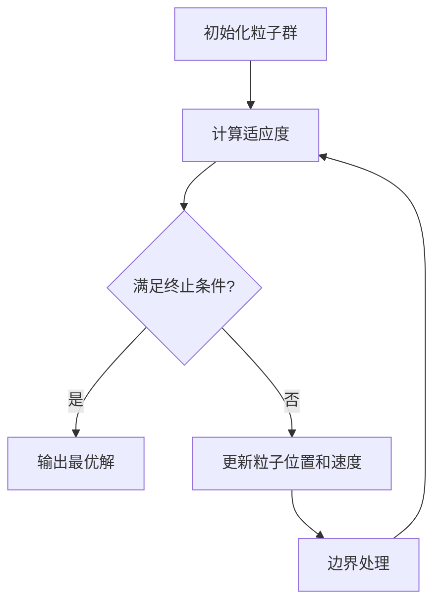

# 烟幕干扰弹投放策略模型（问题二）

## 1. 问题描述与建模目标
利用无人机FY1投放1枚烟幕干扰弹实施对导弹M1的干扰，需确定：
- 无人机飞行方向 $\theta$（航向角）
- 飞行速度 $v_F$
- 烟幕干扰弹投放点（由投放时刻 $t_{\text{rel}}$ 决定）
- 烟幕干扰弹起爆点（由起爆延迟 $\Delta t_{\text{delay}}$ 决定）

目标：最大化烟幕对真目标的有效遮蔽时间

## 2. 决策变量定义
| 变量     | 符号                      | 定义域              |
| -------- | ------------------------- | ------------------- |
| 航向角   | $\theta$                  | $[-\pi, \pi]$ rad   |
| 飞行速度 | $v_F$                     | $[70, 140]$ m/s     |
| 投放时刻 | $t_{\text{rel}}$          | $t \geq 0$ s        |
| 起爆延迟 | $\Delta t_{\text{delay}}$ | $\Delta t \geq 0$ s |

## 3. 运动学模型（引入决策变量）

### 无人机轨迹
$$\mathbf{F}(t) = \mathbf{F}_0 + v_F \cdot t \cdot \begin{bmatrix} \cos\theta \\ \sin\theta \\ 0 \end{bmatrix}$$

### 干扰弹轨迹（$t \geq t_{\text{rel}}$）
$$\mathbf{B}(t) = \mathbf{F}(t_{\text{rel}}) + v_F (t - t_{\text{rel}}) \begin{bmatrix} \cos\theta \\ \sin\theta \\ 0 \end{bmatrix} + \begin{bmatrix} 0 \\ 0 \\ -\frac{1}{2}g(t - t_{\text{rel}})^2 \end{bmatrix}$$

### 云团中心轨迹（$t \geq t_{\text{det}}$）
$$\mathbf{C}(t) = \mathbf{B}(t_{\text{det}}) + \begin{bmatrix} 0 \\ 0 \\ -v_{\text{sink}}(t - t_{\text{det}}) \end{bmatrix}$$
其中 $t_{\text{det}} = t_{\text{rel}} + \Delta t_{\text{delay}}$

## 4. 遮蔽判据与目标函数

### 圆柱体表面采样
- 采样点集 $S = \{\mathbf{T}_j\}_{j=1}^N$（$N=100$）
- 采样策略：按表面积比例分配侧面与顶面采样点

### 视线段定义
对每个采样点 $\mathbf{T}_j$：
$$L_j(s; t) = \mathbf{T}_j + s \left[\mathbf{M}_1(t) - \mathbf{T}_j\right], \quad s \in [0,1]$$

### 最小距离计算
$$\begin{aligned}
d_j(t) &= \min_{s\in[0,1]} \|\mathbf{C}(t) - L_j(s; t)\| \\
d_{\max}(t) &= \max_{1\leq j\leq N} d_j(t)
\end{aligned}$$

### 遮蔽指示函数
$$I(t) = \begin{cases} 
1 & \text{if } d_{\max}(t) \leq r_{\text{cloud}} \\ 
0 & \text{otherwise}
\end{cases}$$

### 目标函数（最大化）
$$J(\theta, v_F, t_{\text{rel}}, \Delta t_{\text{delay}}) = \int_{t_{\text{det}}}^{t_{\text{det}} + 20} I(t)  dt$$

## 5. 优化问题表述
$$\max_{\theta, v_F, t_{\text{rel}}, \Delta t_{\text{delay}}} J(\theta, v_F, t_{\text{rel}}, \Delta t_{\text{delay}})$$
subject to:
$$\begin{aligned}
\theta &\in [-\pi, \pi] \\
v_F &\in [70, 140] \\
t_{\text{rel}} &\geq 0 \\
\Delta t_{\text{delay}} &\geq 0
\end{aligned}$$

## 6. 求解策略：粒子群优化（PSO）

### 粒子表示
每个粒子表示为4维向量：
$$\mathbf{x} = [\theta, v_F, t_{\text{rel}}, \Delta t_{\text{delay}}]$$

### 适应度函数
$$f(\mathbf{x}) = J(\theta, v_F, t_{\text{rel}}, \Delta t_{\text{delay}})$$

### 算法参数
| 参数           | 值      | 说明         |
| -------------- | ------- | ------------ |
| 粒子数         | 50      | 种群规模     |
| 最大迭代       | 100     | 终止条件     |
| 认知系数 $c_1$ | 1.5     | 个体经验权重 |
| 社会系数 $c_2$ | 2.0     | 群体经验权重 |
| 惯性权重 $w$   | 0.9→0.4 | 线性递减     |

### 边界处理
- 周期性边界：$\theta$（模 $2\pi$）
- 反射边界：$v_F, t_{\text{rel}}, \Delta t_{\text{delay}}$

### 离散化处理
- 时间积分：$[t_{\text{det}}, t_{\text{det}}+20]$ 离散为1000点
- 圆柱采样：100点（70侧面+30顶面）

## 7. 算法流程

## 8. 结果分析指标
1. 最大遮蔽时长 $T_{\max}$
2. 最优航向角 $\theta^*$（度）
3. 最优速度 $v_F^*$（m/s）
4. 最优投放时刻 $t_{\text{rel}}^*$（s）
5. 最优起爆延迟 $\Delta t_{\text{delay}}^*$（s）
6. 收敛曲线：最佳适应度 vs 迭代次数

## 9. 创新点与优势
1. **全视线判定**：确保圆柱目标全方位遮蔽
2. **自适应采样**：根据圆柱几何特征优化采样点分布
3. **高效积分**：时间窗离散化结合向量化计算
4. **鲁棒优化**：PSO处理非凸、不连续目标函数

## 10. 潜在挑战与改进
1. **计算效率**：并行计算适应度函数
2. **局部最优**：多起点初始化策略
3. **参数敏感**：自适应参数调整
4. **约束处理**：显式处理时间窗约束

## 11. 预期成果
1. 最优投放策略四元组 $(\theta^*, v_F^*, t_{\text{rel}}^*, \Delta t_{\text{delay}}^*)$
2. 最大遮蔽时长 $T_{\max}$
3. 收敛特性分析
4. 参数敏感性分析